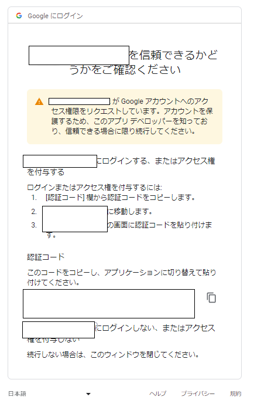

# Googleカレンダーへサマリー登録

### Development

```go
go run . -ym "202304" -days "20230401,20230402,20230408,20230409,20230415,20230416,20230422,20230423,20230429,20230430"
```

```go
go build
```

```sh
path\to\gc-link.exe -ym "202304" -days "20230401,20230402,20230403,20230408,20230409,20230415,20230416,20230422,20230423,20230429,20230430"
```

### 概要

- 差分検出して作成と削除処理

- パラメーターは対象年月と休日一覧

- OAuth2認証して実行(リダイレクト先のサイトで認証コードを発行する)

　リフレッシュトークンは無効化されるかもしれないので(実行回数がそもそも少ない)使用せずに再認証

 